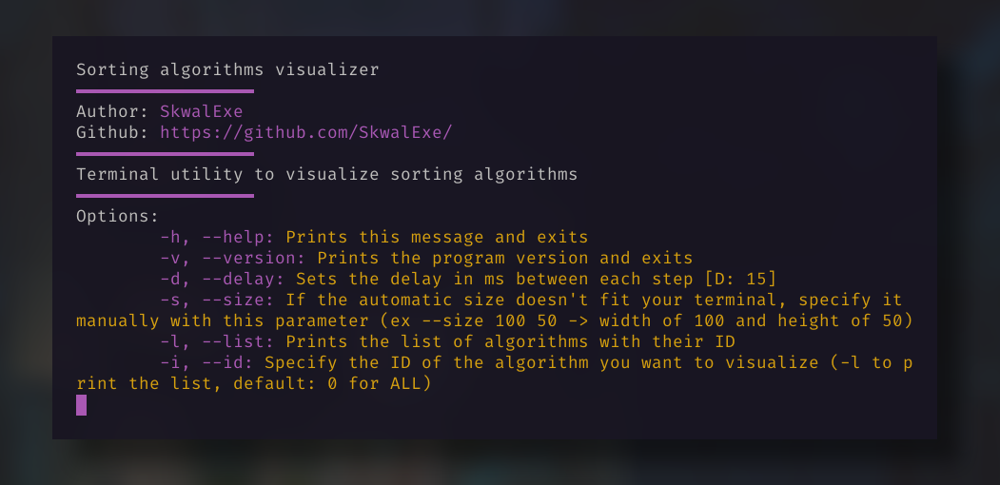

# sorting-algorithms


📶 Sorting algorithms visualizer - in your terminal!

# Installation 📦

## Arch linux 🐧 - Use your AUR helper

```bash
yay -S sorting-algorithms
```

## Other - build from source ⚙️

Run make 

```bash
# 📂 sorting-algorithms
make
```

Add binary to bin folder

```bash
# 📂 sorting-algorithms
make install
```

# Usage 📝



# Uninstall

```bash
# 📂 sorting-algorithms
make uninstall
# This will just delete /usr/bin/sorting-algorithms
```

# final

If you have any problem, don't hesitate to open an issue

# contributing

Pull requests are welcome. For major changes, please open an issue first to discuss what you would like to change.
